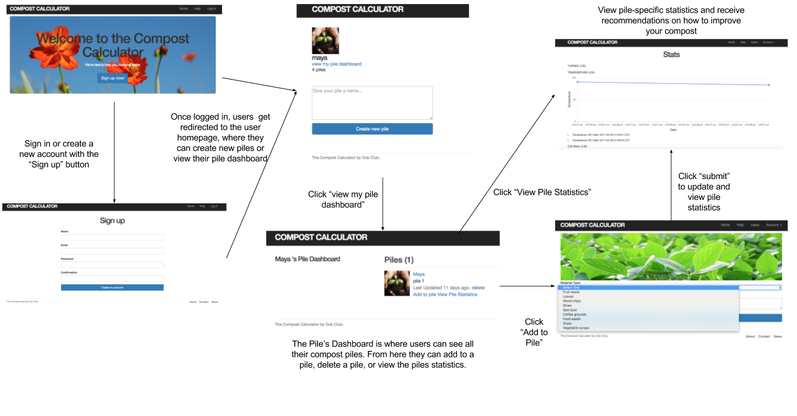

# CompostCalculator

Imagine one day you decide to apply your talents at composting; however are unsure how to compost successfully. Well the Compost Calculator is here to help! The goal of the Compost Calculator is to help composters maintain and track their compost piles so that they can produce high quality compost.  All the user has to do is sign up, create a compost pile, and update their virtual pile according to what they put in their pile in real life. Along the way the Compost Calculator will give the user recommendations on how to achieve the highest quality compost. The Compost Calculator aims to help users achieve the correct ratio of carbon to nitrogen, which is typically between 25:1 and 30:1, and ensure that their pile is within an optimal temperature range. This app is geared towards small scale composters, like home gardeners or students in dorms. 

The product description as provided by our client is as follows:
“It would be useful to have an interface that could inform students of the amount and a type of material to add to optimize composting conditions. In addition, it could be nice for this interface to inform students when they should turn compost so it can maintain the optimal 40-60 C temperature (see http://compost.css.cornell.edu/physics.html). Since we are beginning a student composting initiative at Harvey Mudd, this resource will likely be very valuable to students managing compost.” ~ Zach Evans, contact for ESW/MOSS

## Installation

1. Clone the repo to your desktop.
2. Type 'brew -v' into the terminal. If it is uninstalled, run 
 `ruby -e "$(curl -fsSL https://raw.githubusercontent.com/Homebrew/install/master/install)"`
3. You need to make sure you have MySQL installed on your laptop: `brew install mysql` followed by `mysql.server start`
4. Once MySQL is installed; you need to start up MySQL as the root user: `mysql -u root`
5. Create a local database called CompostCalc_development: `CREATE DATABASE CompostCalc_development;`
6. Create a user called user1 and set up a password: `CREATE USER 'user1'@'localhost' IDENTIFIED BY 'password';`
7. Grant privileges for that user (user1) on the database of interest: `GRANT ALL PRIVILEGES ON CompostCalc_development.* TO 'user1'@'localhost';`
8. Quit out of MySQL: `quit;`
9. Navigate to "CompostCalculator/compost" directory in the downloaded location.
10. Run `bundle install` to install all neccessary gems for the application.
11. Run `rails db:migrate` to setup the database for the application.
12. Type `rails s` to start the application on a localhost server.
13. Open a browser and nagivagte to localhost:3000 to begin using the application.

## Usage

## Current Known Issues
1. While adding elements of a compost pile, if a non-integer is entered for contents weight, it corrupts the pile's contents.

## Contributing

1. Fork it!
2. Create your feature branch: `git checkout -b my-new-feature`
3. Commit your changes: `git commit -am 'Add some feature'`
4. Push to the branch: `git push origin my-new-feature`
5. Submit a pull request :D

## License

MIT License

Copyright (c) 2017 Devang Patel, Maya Thomas, Evan Chrisinger, Amberlee Baugus

Permission is hereby granted, free of charge, to any person obtaining a copy
of this software and associated documentation files (the "Software"), to deal
in the Software without restriction, including without limitation the rights
to use, copy, modify, merge, publish, distribute, sublicense, and/or sell
copies of the Software, and to permit persons to whom the Software is
furnished to do so, subject to the following conditions:

The above copyright notice and this permission notice shall be included in all
copies or substantial portions of the Software.

THE SOFTWARE IS PROVIDED "AS IS", WITHOUT WARRANTY OF ANY KIND, EXPRESS OR
IMPLIED, INCLUDING BUT NOT LIMITED TO THE WARRANTIES OF MERCHANTABILITY,
FITNESS FOR A PARTICULAR PURPOSE AND NONINFRINGEMENT. IN NO EVENT SHALL THE
AUTHORS OR COPYRIGHT HOLDERS BE LIABLE FOR ANY CLAIM, DAMAGES OR OTHER
LIABILITY, WHETHER IN AN ACTION OF CONTRACT, TORT OR OTHERWISE, ARISING FROM,
OUT OF OR IN CONNECTION WITH THE SOFTWARE OR THE USE OR OTHER DEALINGS IN THE
SOFTWARE.
